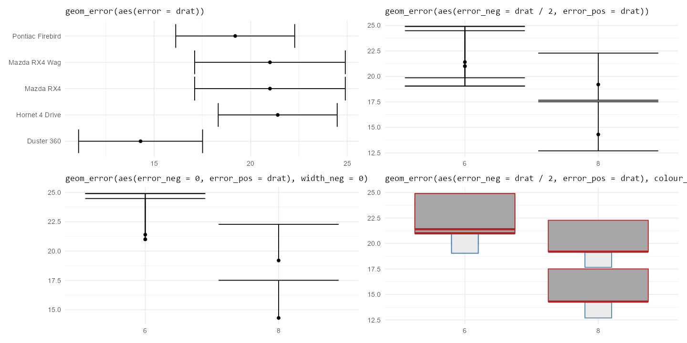

# ggerror 

[](https://orcid.org/0009-0009-0509-3609)

`ggerror` extends **ggplot2**'s range geoms with an error-first API.
Instead of wiring `ymin` / `ymax` or `xmin` / `xmax` by hand, you supply
`error`, or `error_neg` + `error_pos`, and use one interface across
error bars, lineranges, crossbars, and pointranges.

### Motivation

It removes the mechanical error-bar work while keeping the usual `ggplot2`
geoms, and adds asymmetric plus per-side styling when you need more control.

### Installation

``` r
pak::pak('iamyannc/ggerror')

library(ggplot2)
library(ggerror)

p <- ggplot(mtcars, aes(factor(cyl), mpg)) +
  geom_point()

p + geom_error(aes(error_neg = drat / 2, error_pos = drat))
```

For a full tour of symmetric, asymmetric, one-sided, and per-side styling,
see `vignette("ggerror")`.

<a href="man/figures/examples.png">  </a>

### Supported geoms

| ggplot2 Base      | `geom_error(error_geom = ...)` | Specific Wrapper          |
|:------------------|:-------------------------------|:--------------------------|
| `geom_errorbar`   | `"errorbar"` (default)         | `geom_error()`            |
| `geom_linerange`  | `"linerange"`                  | `geom_error_linerange()`  |
| `geom_pointrange` | `"pointrange"`                 | `geom_error_pointrange()` |
| `geom_crossbar`   | `"crossbar"`                   | `geom_error_crossbar()`   |

### Disclaimer

This package was developed with the assistance of AI tools. All code has been reviewed by the author, who remains responsible for its quality. Ideas for new geoms are welcome.
