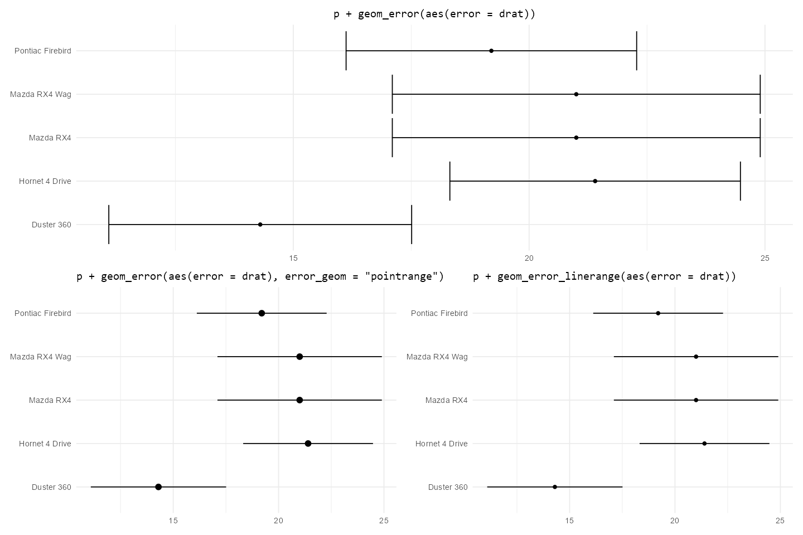
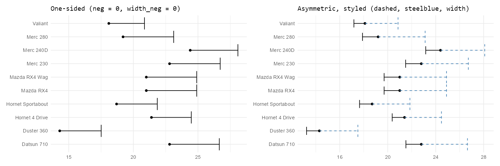

# ggerror 

[](https://orcid.org/0009-0009-0509-3609)


[](https://CRAN.R-project.org/package=ggerror)
[](https://github.com/iamYannC/ggerror/actions/workflows/R-CMD-check.yaml)
[](https://app.codecov.io/gh/iamYannC/ggerror)


`ggerror` simplifies **ggplot2**'s error geoms and introduces asymetric error bars and customization.

Instead of wiring `ymin` / `ymax` or `xmin` / `xmax` by hand, you supply
`error` (or `error_neg` + `error_pos`) and `ggerror` will do the rest for you. It can be as simple as providing a single `error` argument, yet offer full customization options for per-side styling.

### Installation 

``` r

install.packages("ggerror") # 0.3.0 
pak::pak("iamyannc/ggerror") # 1.0.0 - better error messages & stat_error & sign_aware!

library(ggplot2)
library(ggerror)

p <- ggplot(mtcars, aes(mpg, rownames(mtcars))) +
  geom_point()

# Symmetric error bars, using default geom errorbar
p + geom_error(aes(error = drat))

# Asymmetric error bars, using geom_error_pointrange and per-side styling
p + geom_error_pointrange(aes(error_neg = drat / 2, error_pos = drat, linetype_neg = "dashed"))

# One-sided error bars, using the error_geom argument
p + geom_error(error_geom = "linerange", aes(error_neg = NA, error_pos = drat))

```
#### Symmetric error bars

<a href="man/figures/examples_basic.png">  </a>

#### Asymmetric error bars

<a href="man/figures/examples_asymmetric.png">  </a>


For detailed examples of symmetric, asymmetric, one-sided, and per-side styling,
see [`vignette("ggerror")`](https://iamyannc.github.io/ggerror/articles/ggerror.html).


### Supported geoms

| ggplot2 Base      | `geom_error(error_geom = ...)` | Specific Wrapper          |
|:------------------|:-------------------------------|:--------------------------|
| `geom_errorbar`   | `"errorbar"` (default)         | `geom_error()`            |
| `geom_linerange`  | `"linerange"`                  | `geom_error_linerange()`  |
| `geom_pointrange` | `"pointrange"`                 | `geom_error_pointrange()` |
| `geom_crossbar`   | `"crossbar"`                   | `geom_error_crossbar()`   |


### Disclaimer

This package was developed with the assistance of AI tools. All code has been reviewed by the author, who remains responsible for its quality. Ideas for new geoms are welcome.
