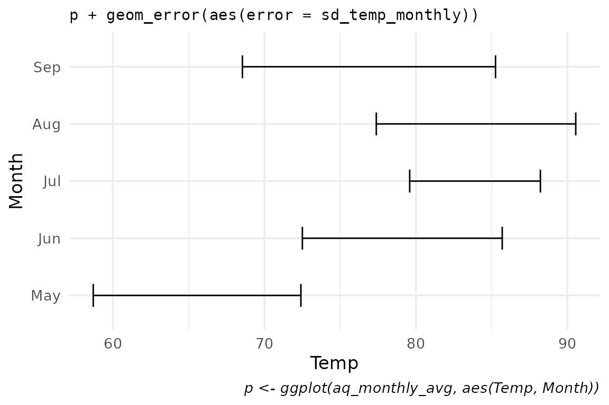
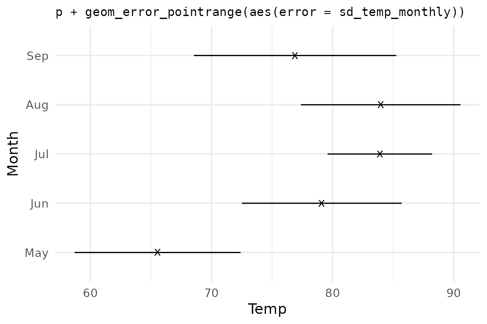
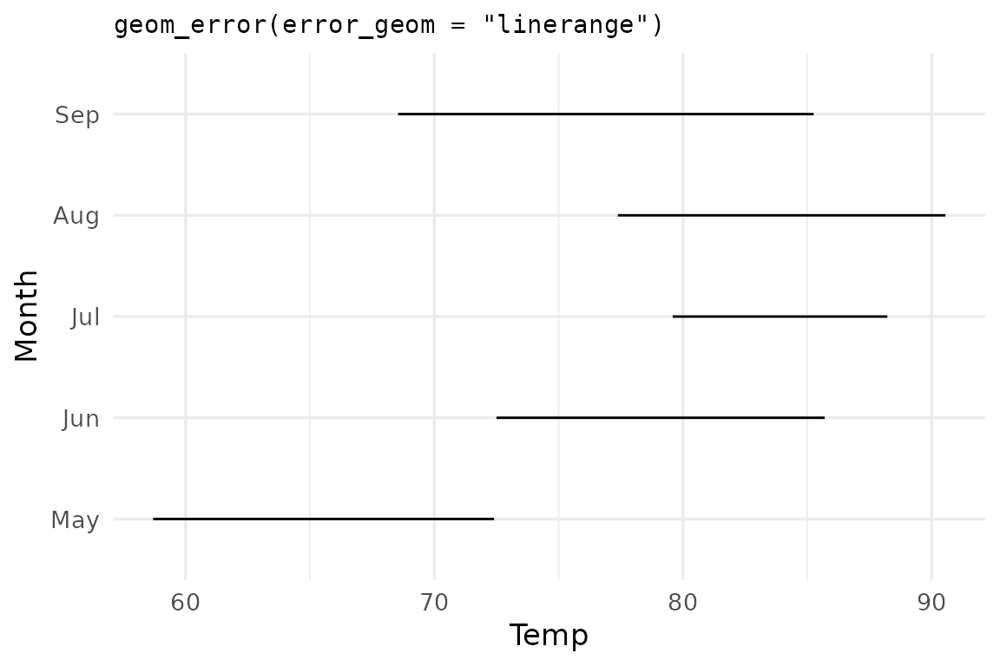
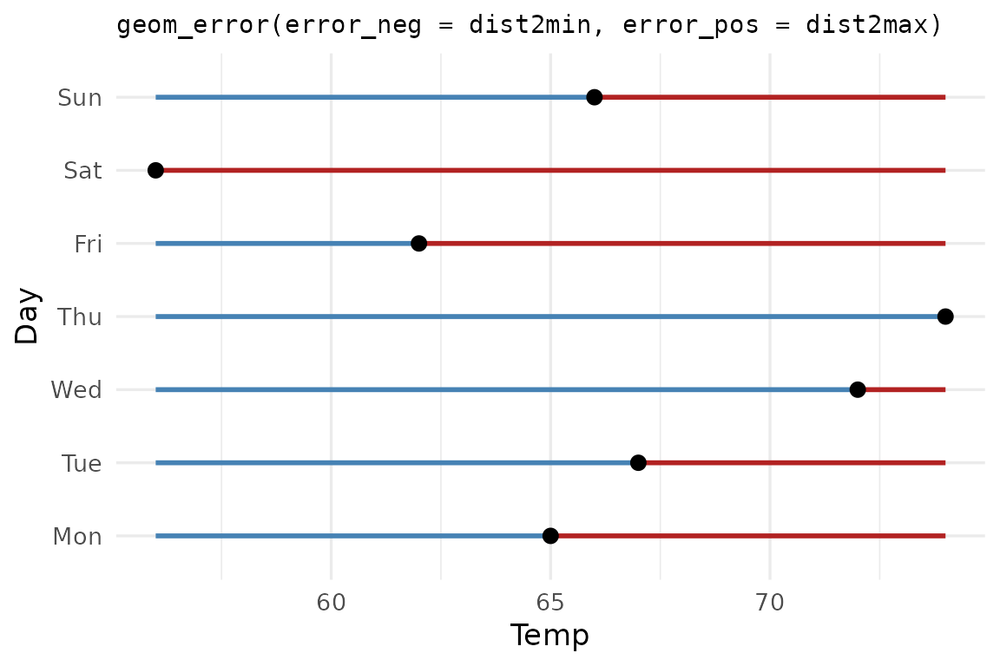
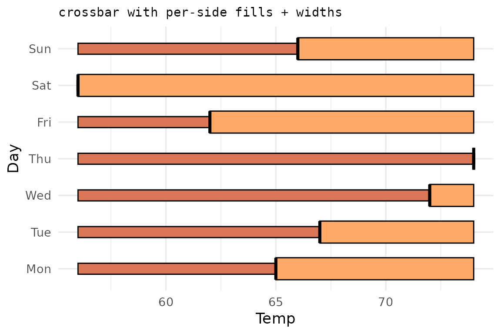
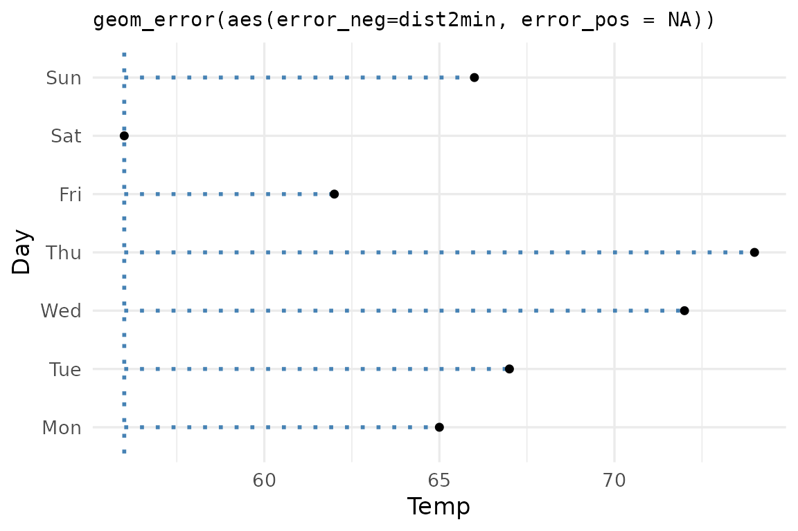

# Using ggerror

## Why `ggerror`?

`ggplot2` ships several error geoms. `ggerror` started as a wrapper to
simplify their usage by replacing the `x/y`-`min/max` inputs with one
aesthetic: **`error`**. This doesn’t just simplify the API, it also
shifts the focus to the actual intention: to visualize some magnitude as
error that extends from a specified value (or a central metric; more on
that in
[`vignette("use-cases")`](https://iamyannc.github.io/ggerror/articles/use-cases.md)).

`ggerror` is no longer just a wrapper; it offers extra functionality
compared to `ggplot2`’s core error geoms.

This vignette demonstrates the basic usage of the package. For
[`stat_error()`](https://iamyannc.github.io/ggerror/reference/stat_error.md)
summaries and `sign_aware` errors, see
[`vignette("use-cases")`](https://iamyannc.github.io/ggerror/articles/use-cases.md).

## Setup

We use `airquality` — Daily air quality measurements in New York, May to
September 1973.

This dataset has 153 rows and 6 columns: four continuous measurements,
plus Month and Day.

``` r
data("airquality"); airq <- airquality

# It wouldn't be an R workflow without minimal data cleaning...
day_in_month <- function(day_in_month, month, year) {
  days_abbr <- format(as.Date(sprintf("%d-%02d-%02d", year, month, day_in_month)), "%a")
  factor(days_abbr, levels = c("Mon","Tue","Wed","Thu","Fri","Sat","Sun"), ordered = TRUE)

}
airq$Day <- day_in_month(airq$Day, airq$Month, 1973)
airq$Month <- factor(airq$Month, labels = month.abb[5:9])


# summary table, grouped by month with Temp's means and standard deviation 
aq_monthly_avg <- data.frame(
  Month = unique(airq$Month),
  Temp = tapply(airq$Temp, airq$Month, mean),
  sd_temp_monthly   = tapply(airq$Temp, airq$Month, sd)
)

p <- ggplot(aq_monthly_avg, aes(Temp, Month))
```

## Simple and defaults

A single `error` aesthetic is enough — `ggerror` infers orientation from
the data (here: numeric x axis, discrete y axis) and picks
`geom_errorbar` as the default base geom.

``` r

p + 
  geom_error(aes(error = sd_temp_monthly),
             width = 0.4) +
  labs(title = "p + geom_error(aes(error = sd_temp_monthly))",
       caption = "p <- ggplot(aq_monthly_avg, aes(Temp, Month))"
       )
```



Same data, pinned
[`geom_error_pointrange()`](https://iamyannc.github.io/ggerror/reference/geom_error.md)
wrapper:

``` r
p +
  geom_error_pointrange(aes(error = sd_temp_monthly),
                        size = 0.8,
                        shape = "x") +
  labs(title = "p + geom_error_pointrange(aes(error = sd_temp_monthly))")
```



Same data, swapped via the `error_geom` argument:

``` r
p +
  geom_error(aes(error = sd_temp_monthly),
             error_geom = "linerange") +
  labs(title = "geom_error(error_geom = \"linerange\")")
```



💡 **Tip:** Because `error_geom` is just an argument, you can iterate
over it functionally:

``` r
purrr::map(c("errorbar", "linerange", "crossbar", "pointrange"),
           ~ p + geom_error(aes(error = sd_temp_monthly), error_geom = .x))
```

## Asymmetric errors

`error_neg` and `error_pos` extend in opposite directions regardless of
orientation. They’re useful when the dispersion measure on each side
carries different meaning.

``` r
may_week <- subset(airq[1:7,], Month == 'May')

may_summary <- data.frame(
  Day = may_week$Day,
  Temp = may_week$Temp,
  dist2min = may_week$Temp - min(may_week$Temp, na.rm = TRUE),
  dist2max = max(may_week$Temp, na.rm = TRUE) - may_week$Temp
) # Each Temp point now has its distance from the minimum Temp in the
  # dataset, and its distance from the maximum Temp in the dataset.
```

``` r

ggplot(may_summary, aes(x = Temp, y = Day)) +
  geom_error(aes(error_neg =  dist2min,
                 error_pos = dist2max),
             error_geom = "pointrange",
             color_neg = "steelblue",
             color_pos = "firebrick",
             linewidth  = 1
             ) +
  labs(title = "geom_error(error_neg = dist2min, error_pos = dist2max)")
```



Deciding what counts as the negative or the positive error is up to your
discretion.

Per-side styling extends to `color`, `fill`, `linewidth`, `linetype`,
`alpha`, and `width`. Pass either the side-specific form (`color_neg`,
`width_pos`) or the shared form (`color`, `width`).

``` r
ggplot(may_summary, aes(Temp, Day)) +
  geom_error(aes(error_neg = dist2min,
                 error_pos = dist2max),
             error_geom = "crossbar",
             fill_neg = "#d97757", fill_pos = "#ffaa66",
             width_neg = 0.3,     width_pos = 0.6) +
  labs(title = "crossbar with per-side fills + widths")
```



## One-sided bars

Sometimes we care mostly about errors towards one side, and dismiss the
other as uninteresting. For example, how each observation falls *below*
a threshold. Set the unused side to `NA` and `ggerror` suppresses the
cap and stem on that side automatically.

``` r
ggplot(may_summary, aes(Temp, Day)) +
  geom_error(aes(error_neg = dist2min, error_pos = NA),
             color = "steelblue",
             linewidth = 1,
             linetype = 9) +
  geom_point(size = 1.5) +
  labs(title = "geom_error(aes(error_neg=dist2min, error_pos = NA))")
```



**Remember:** The errors are simply a magnitude. They don’t even have to
be treated as errors, like in the last couple of examples, where they
are treated as distances from some arbitrary value (in this one-sided
example: the distance of each temperature from the minimum temperature
that was measured).

> Passing `0` instead of `NA` works, but is discouraged, for several
> reasons: 1. `NA` is more explicit than `0`. 2. Since `0` is treated as
> a value, it won’t automatically cap out the undesired side of the
> error bars, for example.

**See
[`vignette("use-cases")`](https://iamyannc.github.io/ggerror/articles/use-cases.md)
for more advanced options**.

## Extending ggerror

If you know of, or need, a new error geom, please open an issue on the
[GitHub repository](https://github.com/iamyannc/ggerror/issues). My
first motivation was to simplify the heck out of the error geoms,
reducing the aesthetics to a single `error` aesthetic. The rest
(asymmetric, one-sided, etc) are just niceties that I added along the
way.
