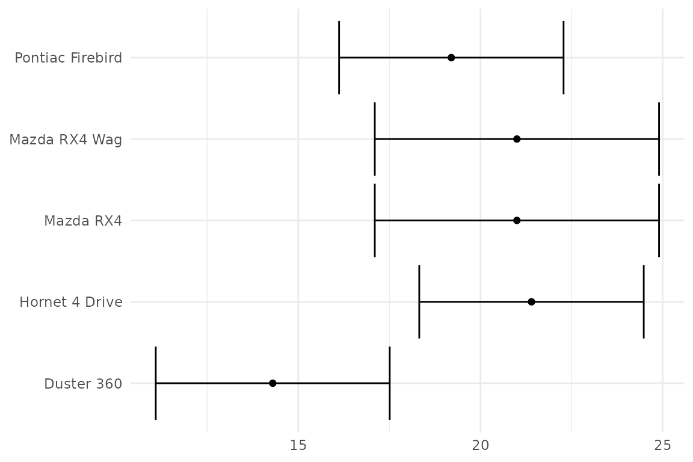
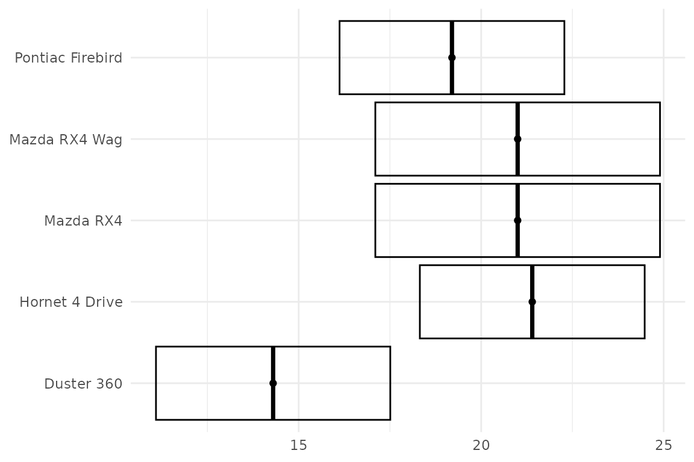
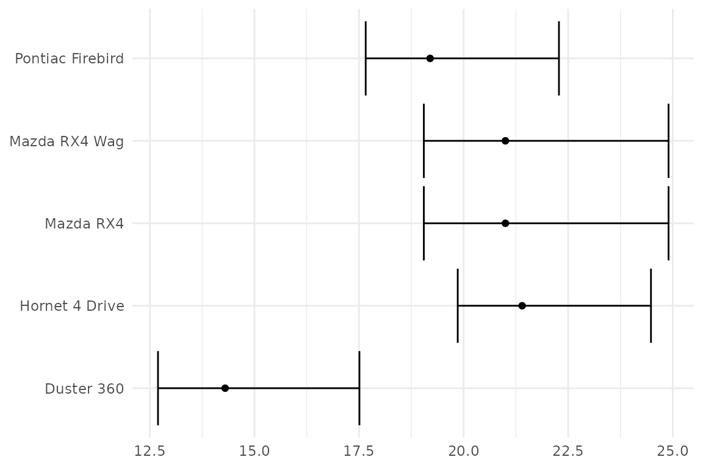
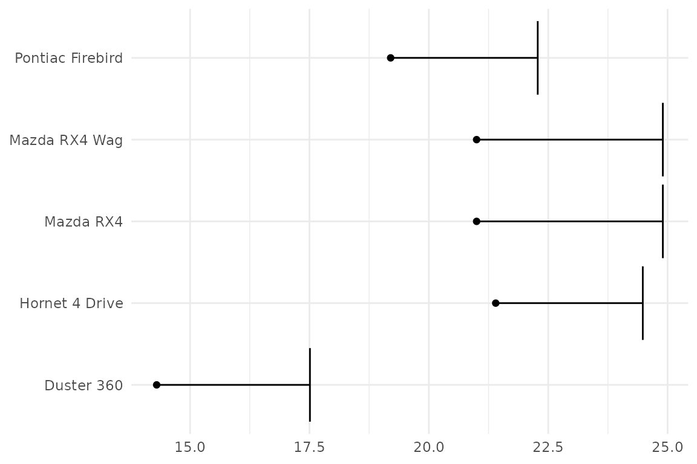
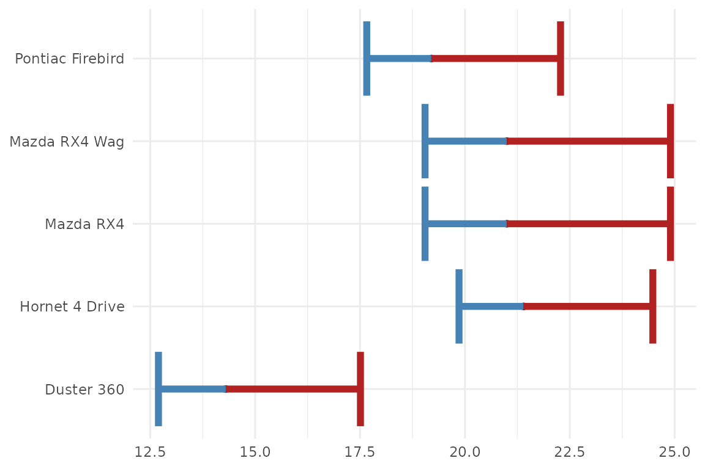
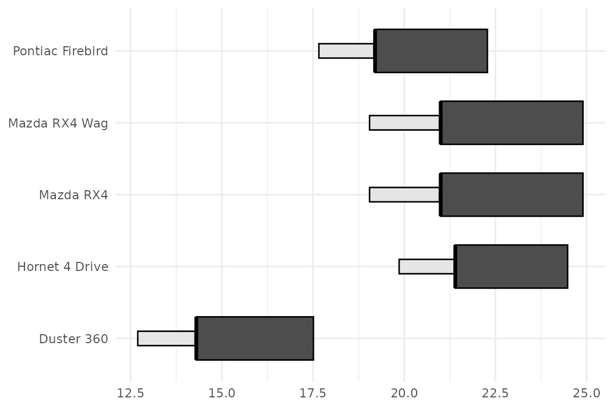

# Using ggerror

``` r
library(ggplot2)
library(ggerror)
```

## Why `ggerror`?

Base `ggplot2` gives you several different error geoms, but using them
means deciding on orientation, which axis the error should follow, and
how to wire the lower and upper bounds correctly. It creates a overhead
and a cluncky DX. `ggerror` collapses that into one layer and one
error-focused API.

Everything in this vignette uses `mtcars`, so you can copy the examples
directly.

``` r
set.seed(1)
mt <- mtcars[sample(nrow(mtcars), 5), ]
mt$rn <- rownames(mt)
```

``` r
set_theme(
  theme_minimal() + theme(
  plot.title = element_text(hjust = 0, family = "consolas", size = 12),
  axis.title = element_blank()
))
p <- ggplot(mt, aes(mpg, rn)) +
  geom_point()
```

## Symmetric errors

``` r
p + geom_error(aes(error = drat))
```



[`geom_error()`](https://iamyannc.github.io/ggerror/reference/geom_error.md)
infers orientation from the data. When one axis is discrete and the
other is numeric, the error expands along the numeric axis. The default
geom is `errorbbar`, which triggers under the hood
[`geom_errorbar()`](https://ggplot2.tidyverse.org/reference/geom_linerange.html).

## Choosing the error geom

You can pick the base range geom either through `error_geom` or via one
of the pinned wrapper functions.

``` r
p + geom_error(aes(error = drat), error_geom = "crossbar")
```



``` r
p + geom_error_crossbar(aes(error = drat))
```


Supported values for `error_geom` are `"errorbar"`, `"linerange"`,
`"crossbar"`, and `"pointrange"`.

💡 **Tip:** Make use of
[`geom_error()`](https://iamyannc.github.io/ggerror/reference/geom_error.md)
for a functional programming approach by using the `error_geom` argument
with [`purrr::map()`](https://purrr.tidyverse.org/reference/map.html).

## Asymmetric errors

Use `error_neg` and `error_pos` when the negative and positive extents
differ.

``` r
  p + geom_error(aes(
    error_neg = drat / 2,
    error_pos = drat)
    )
```



`error_neg` extends in the negative direction and `error_pos` extends in
the positive direction, regardless of whether the error is horizontal or
vertical. Both must be supplied together. Not having to deal with
orientation and `min`/`max` reduces overhead and ensures you stay
focused on displaying the data, rather than the mechanics of the plot.

## One-sided bars

Set the unused side to `NA` for a genuine one-sided error bar —
`ggerror` auto-suppresses the cap and stem on that side.

``` r
p +
  geom_error(aes(
    error_neg = NA,
    error_pos = drat
  ))
```



Passing `0` instead of `NA` still works but is soft-deprecated since
v1.0.0 — you’ll get a migration warning, and you’d also need
`width_neg = 0` to hide the shared cap. `NA` is the cleaner idiom.

## More customization: per-side styling

For finer control, the negative and positive sides can be styled
separately with fixed `_neg` and `_pos` parameters for `colour`, `fill`,
`linewidth`, `linetype`, `alpha`, and `width`.

``` r
p +
  geom_error(aes(
    error_neg = drat / 2,
    error_pos = drat),

    colour_neg = "steelblue",
    colour_pos = "firebrick",
    linewidth = 2 # you can still control both sides of the error bar
  )
```



``` r
p +
  geom_error(aes(
    error_neg = drat / 2,
    error_pos = drat),
    
    error_geom = "crossbar",
    fill_neg = "grey90",
    fill_pos = "grey30",
    width_neg = 0.2,
    width_pos = 0.6
  )
```



## Extending ggerror

If you know of, or need, a new error geom, please open an issue on the
[GitHub repository](https://github.com/iamyannc/ggerror/issues). My
first motiviation was to simplify the heck out of the error geoms,
reducing the aesthetics to a single `error` aesthetic. The rest
(asymmetric, one-sided, etc) are just niceties that I added along the
way.
