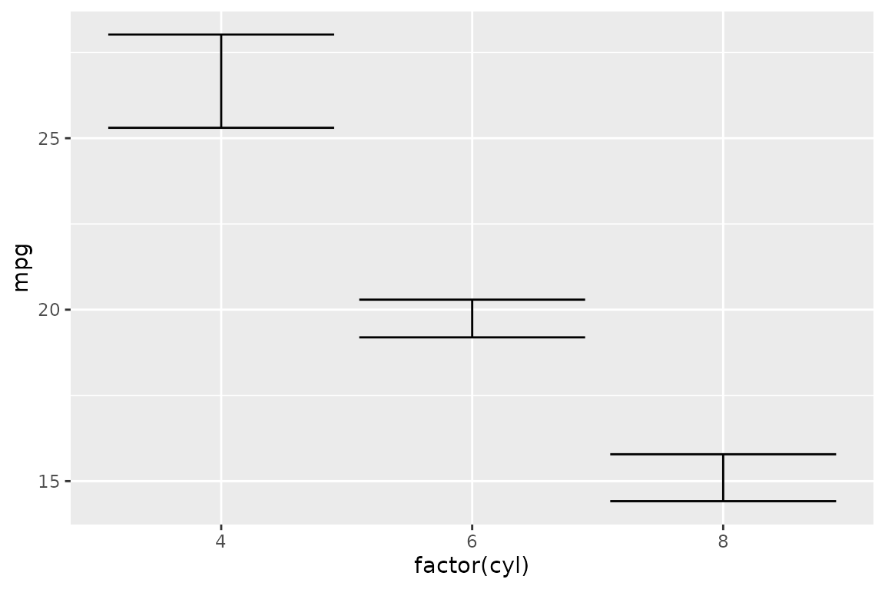
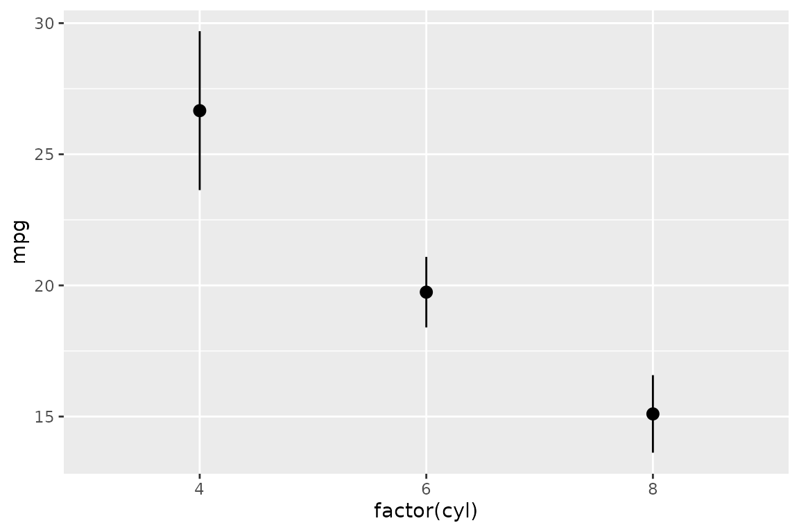
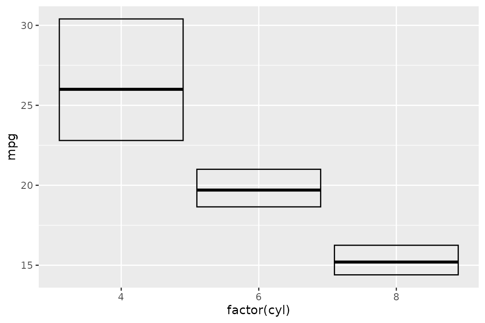
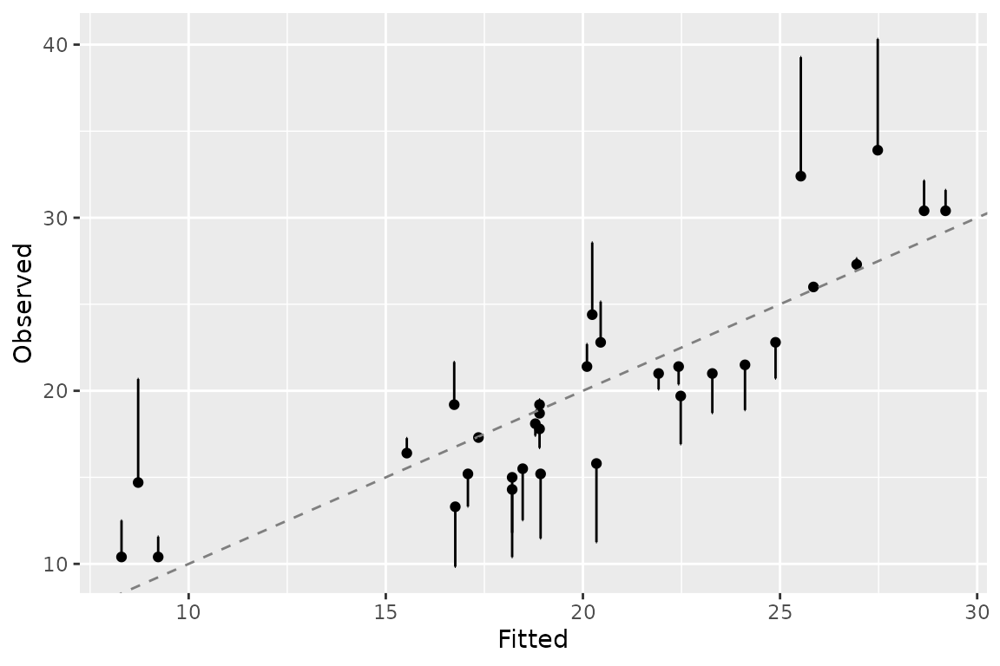
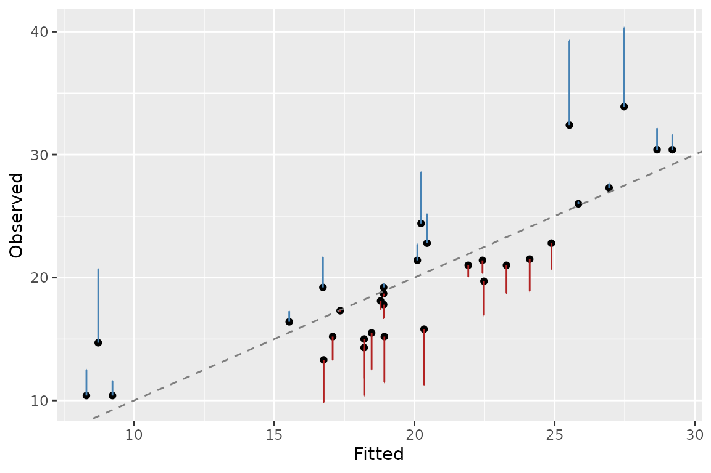

# Residual plots with stat_error() and sign_aware

``` r
library(ggplot2)
library(ggerror)
```

Two v1.0.0 features turn `ggerror` from “an error-bar ergonomics
wrapper” into a genuine statistical layer:

- **[`stat_error()`](https://iamyannc.github.io/ggerror/reference/stat_error.md)**
  summarises raw observation-level data into error bounds per group,
  following ggplot2’s `fun.data` contract.
- **`sign_aware = TRUE`** routes signed values (typically residuals)
  into one-sided bars whose direction encodes the sign.

## `stat_error()`: summarise on the fly

Pass raw observations and let the stat compute the error. The default is
`mean_se` — mean with one standard error:

``` r
ggplot(mtcars, aes(factor(cyl), mpg)) +
  stat_error()
```



Swap in `mean_ci` for a 95% normal-theory confidence interval (no
`Hmisc` dependency):

``` r
ggplot(mtcars, aes(factor(cyl), mpg)) +
  stat_error(fun = "mean_ci", error_geom = "pointrange")
```



You can also pass a custom function following ggplot2’s `fun.data`
contract — it takes a numeric vector and returns a single-row data frame
with columns `y`, `ymin`, `ymax`:

``` r
iqr <- function(y) {
  data.frame(
    y    = median(y),
    ymin = stats::quantile(y, 0.25, names = FALSE),
    ymax = stats::quantile(y, 0.75, names = FALSE)
  )
}

ggplot(mtcars, aes(factor(cyl), mpg)) +
  stat_error(fun = iqr, error_geom = "crossbar")
```



[`stat_error()`](https://iamyannc.github.io/ggerror/reference/stat_error.md)
and `geom_error(stat = "error")` are equivalent — use whichever reads
better in context.

## `sign_aware`: residuals as one-sided bars

For a residual plot, center `x`/`y` on the fitted value and let the bar
extend toward the observed value. Positive residuals route to
`error_pos`, negative to `error_neg`, and the opposite side is
auto-suppressed:

``` r
model <- lm(mpg ~ wt, data = mtcars)

ggplot(mtcars, aes(fitted(model), mpg)) +
  geom_point() +
  geom_abline(slope = 1, intercept = 0, linetype = 2, colour = "grey50") +
  geom_error(aes(error = resid(model)),
             sign_aware = TRUE, orientation = "x") +
  labs(x = "Fitted", y = "Observed")
```



The bar points *from* fitted *to* observed: sign encodes direction,
length encodes magnitude. Both axes are numeric, so pass
`orientation = "x"` to get vertical bars (the error extends along `y`,
the observed axis).

Colour the halves separately to make the direction even more obvious:

``` r
ggplot(mtcars, aes(fitted(model), mpg)) +
  geom_point() +
  geom_abline(slope = 1, intercept = 0, linetype = 2, colour = "grey50") +
  geom_error(
    aes(error = resid(model)),
    sign_aware = TRUE,
    orientation = "x",
    colour_neg = "firebrick",
    colour_pos = "steelblue"
  ) +
  labs(x = "Fitted", y = "Observed")
```



## A note on incompatibility

`sign_aware` routes *signed* per-row values, while
[`stat_error()`](https://iamyannc.github.io/ggerror/reference/stat_error.md)
summarises raw observations into bounds — there is no sign to route.
Combining them raises a classed error
(`ggerror_error_sign_aware_with_stat`).
