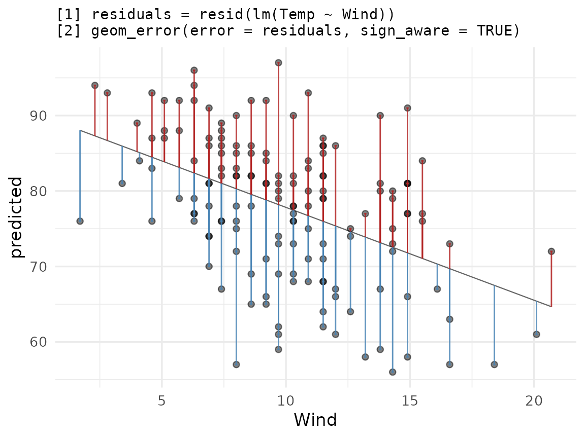
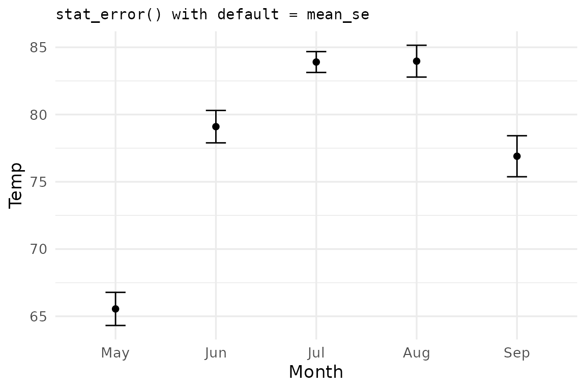
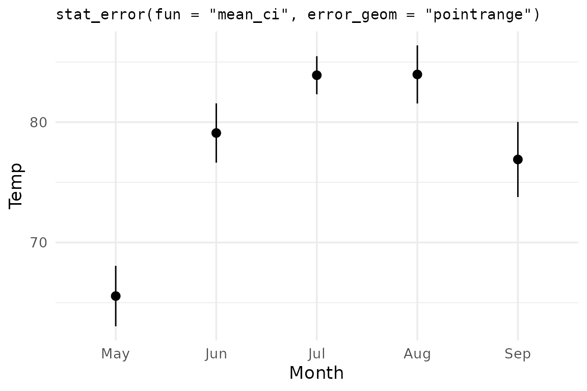
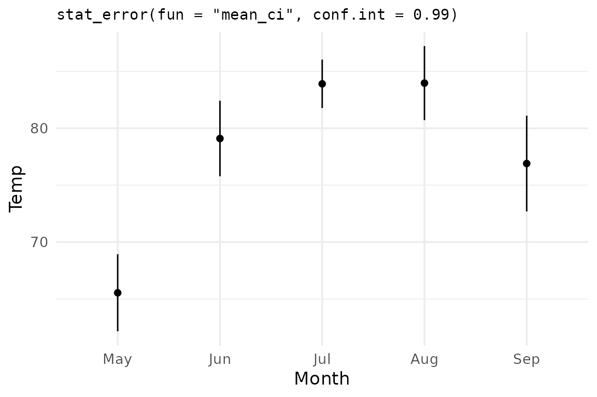
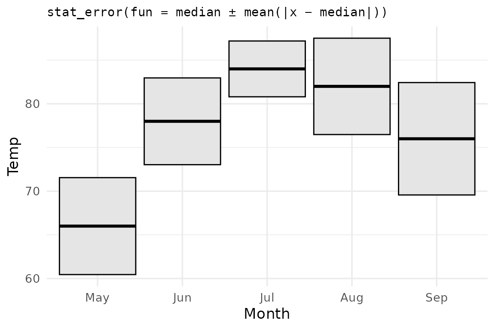
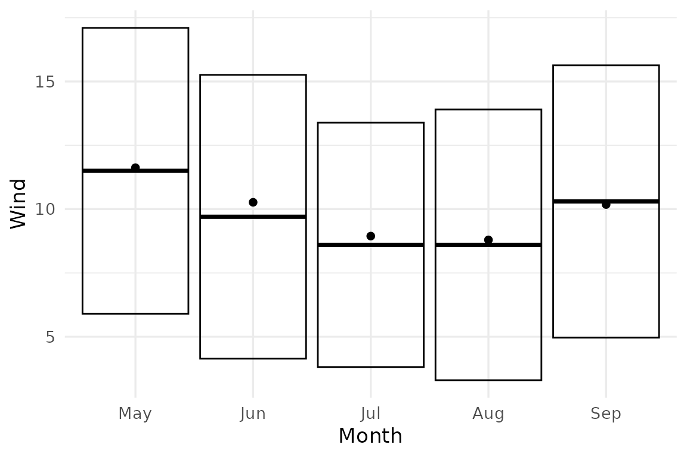

# Use cases: stats and residuals

This vignette demonstrates more advanced usage of the package. For a
getting-started guide and overview of this package’s basic use case, see
[`vignette("ggerror")`](https://iamyannc.github.io/ggerror/articles/ggerror.md).

## Setup

We use `airquality` — Daily air quality measurements in New York, May to
September 1973.

This dataset has 153 rows with 6 columns: 4 continuous measurements,
Month and Day.

``` r
data("airquality"); airq <- airquality

# It wouldn't be an R workflow without minimal data cleaning...
day_in_month <- function(day_in_month, month, year) {
  days_abbr <- format(as.Date(sprintf("%d-%02d-%02d", year, month, day_in_month)), "%a")
  factor(days_abbr, levels = c("Mon","Tue","Wed","Thu","Fri","Sat","Sun"), ordered = TRUE)
}
airq$Day <- day_in_month(airq$Day, airq$Month, 1973)
airq$Month <- factor(airq$Month, labels = month.abb[5:9])
```

More on `airquality` (click to expand, or type `?airquality`)

`airquality` contains daily New York air-quality measurements from May
to September 1973. The main continuous variables are `Ozone`, `Solar.R`,
`Wind`, and `Temp`; `Month` and `Day` identify when each measurement was
taken.

Let’s use it to show two use cases: plotting a sign-aware residual plot
and summarizing raw data with
[`stat_error()`](https://iamyannc.github.io/ggerror/reference/stat_error.md).

## Residual plot with `sign_aware`

`sign_aware = TRUE` interprets the sign of `error` as direction:
positive values extend in the positive axis direction, negative in the
negative.

### Let’s fit a linear model and see how `Temp` can be explained by `Wind`.

``` r
model   <- lm(Temp ~ Wind, data = airq)
airq_fit <- cbind(airquality[,c('Temp','Wind')],
                  predicted = predict(model),
                  residuals = resid(model)
                 )
```

Let us complement the usual ggplot2 workflow for plotting residuals
versus true values:

``` r
ggplot(airq_fit, aes(x = Wind, y = predicted)) +
  geom_line(linewidth = 0.4, colour = "grey40") +
  geom_point(aes(y = Temp), alpha = 0.5) +
  geom_error(aes(error = residuals),
             sign_aware  = TRUE,
             orientation = "x",
             color_pos  = "firebrick",
             color_neg  = "steelblue",
             linewidth   = 0.5,
             alpha       = 0.85) +
  labs(title = paste(
    "[1] residuals = resid(lm(Temp ~ Wind))",
    "[2] geom_error(error = residuals, sign_aware = TRUE)",
    sep = "\n"
  ))
```



- **Flexible styling**: `ggerror` provides us with per-direction styling
  (`color`) as well as global styles (`alpha`, `linewidth`, etc.). How
  to interpret the plot is up to you. You may want to color the
  direction differently, to show the direction the bar extends, rather
  than the sign of the error. Experiment with this by tweaking either
  the actual color value, or the `neg/pos` suffix.

- **`orientation = "x"`** Because both axes are numeric, `ggerror` can’t
  infer the direction the bar should extend, so we pass
  `orientation = "x"` (which extends the bar along the y axis)
  explicitly. When one axis is discrete, orientation is inferred.

- **NA values vs 0:** An **`NA` value** draws nothing, and triggers a
  row-indexed warning. As in `ggplot2`’s ecosystem, we would usually
  exclude invalid (missing or infinite) values before plotting. 0 is
  treated as any other value, and “draws” a bar of length zero
  (basically, nothing). Using `NA` comes in handy when we want to
  explicitly draw one-sided bars (see
  [`vignette("ggerror")`](https://iamyannc.github.io/ggerror/articles/ggerror.md)).

## Summarizing raw data with `stat_error()`

[`stat_error()`](https://iamyannc.github.io/ggerror/reference/stat_error.md)
follows ggplot2’s `fun.data` contract: pass a summary function and it
computes `y`, `ymin`, `ymax` per group. Regardless of the orientation of
your plot, the summary function **must return a data frame with these
exact column names**.

The default summary function is `mean_se` (mean ± one standard error):

``` r
ggplot(airq, aes(Month, Temp)) +
  stat_error(width = 0.2) +
  stat_summary(geom='point') +
  labs(title = "stat_error() with default = mean_se") 
```



`ggerror` ships two summary functions. You just saw the default,
`mean_se`. The second is `mean_ci` which computes the mean and 95%
confidence interval error bars.

``` r
ggplot(airq, aes(Month, Temp)) +
  stat_error(fun = "mean_ci", error_geom = "pointrange") +
  labs(title = 'stat_error(fun = "mean_ci", error_geom = "pointrange")')
```



The `conf.int` argument controls the CI width — `0.95` by default, but
any valid probability in `(0, 1)` works:

``` r
ggplot(airq, aes(Month, Temp)) +
  stat_error(fun = "mean_ci", conf.int = 0.99,
             error_geom = "linerange") + 
  stat_summary(geom="point") +
  labs(title = 'stat_error(fun = "mean_ci", conf.int = 0.99)')
```



> **Note:** I combine multiple summary geoms. `ggerror` is compatible
> with `ggplot2` (core) and its ecosystem.

### Custom summary function: median ± mean absolute deviation

You shall not be limited by my imagination. Create your own custom
summary functions, as long as they obey the rules I mentioned earlier
(returned object must be a data frame with three columns: `y`, `ymin`,
`ymax` and one numeric row). R’s
[`mad()`](https://rdrr.io/r/stats/mad.html) computes the median absolute
deviation from the median. Let us use the **mean** absolute deviation
(from the median), and call it `mae` (`e` for error, to avoid naming
conflicts).

**median** as the center, **mean absolute deviation from the median** as
the spread:

$${mae}(x) = \frac{1}{n}\sum\limits_{i = 1}^{n}\left| x_{i} - {md}(x) \right|$$

``` r
mae_summary <- function(my_vec, scale_by = 1) {
  md  <- median(my_vec)
  mae <- mean(abs(my_vec - md)) * scale_by
  data.frame(y = md, ymin = md - mae, ymax = md + mae)
}

ggplot(airq, aes(Month, Temp)) +
  stat_error(fun = mae_summary, error_geom = "crossbar",
             fill = "grey90") +
  labs(title = "stat_error(fun = median ± mean(|x − median|))")
```



Custom functions can take extra parameters too —
[`stat_error()`](https://iamyannc.github.io/ggerror/reference/stat_error.md)
forwards any matching named arguments in the same way you are used to
using the `...` argument. In this example, to multiply the error by 2,
you’d write `stat_error(fun = mae_summary, scale_by = 2)`.

Passing `scale_by = 2` to `stat_error`

``` r
ggplot(airq, aes(Month, Temp)) +
  stat_error(fun = mae_summary, scale_by = 2, error_geom = "crossbar") +
  stat_summary(geom = "point")
```



> **Aside** — `geom_error(stat = "error", fun = ...)` is the layer-level
> equivalent of
> [`stat_error()`](https://iamyannc.github.io/ggerror/reference/stat_error.md),
> which by default uses `stat = "identity"`.
