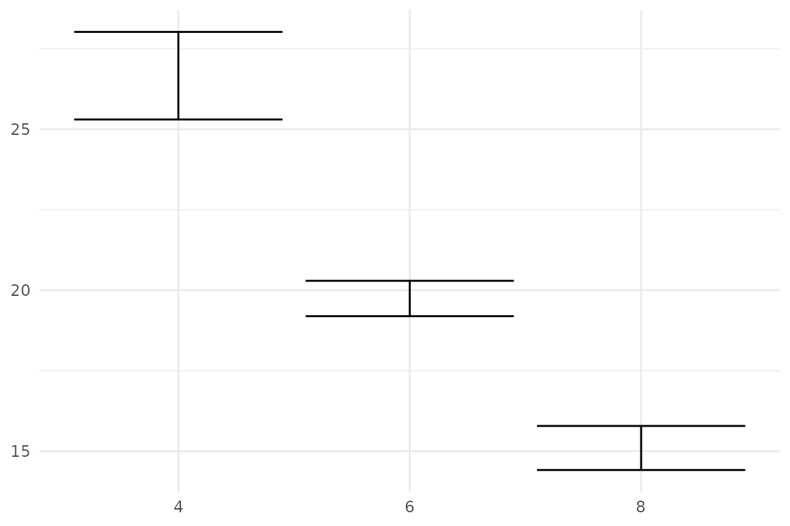
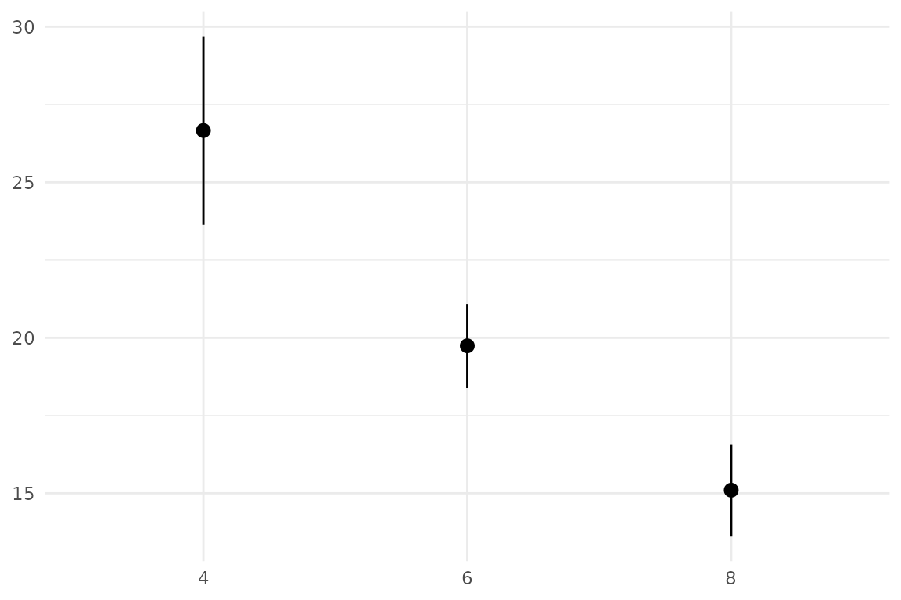
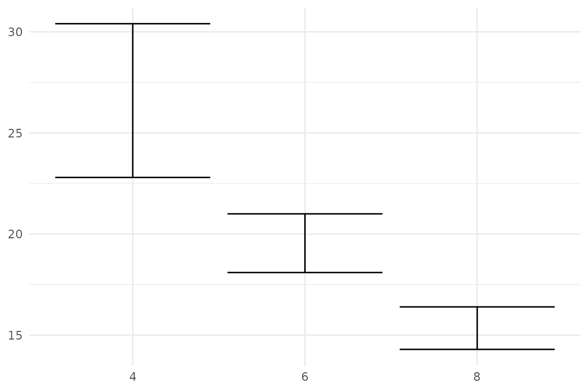
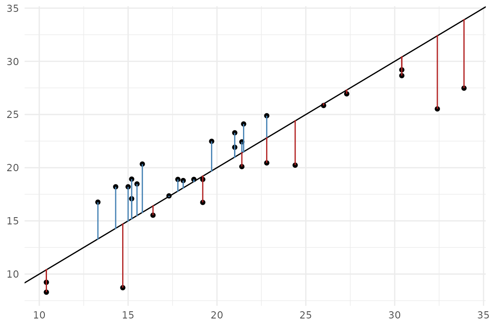

# v1.0.0 features: stat_error() and sign_aware

``` r
library(ggplot2)
library(ggerror)

set_theme(
  theme_minimal() + theme(
  plot.title = element_text(hjust = 0, family = "consolas", size = 12),
  axis.title = element_blank()
))
```

Version 1.0.0 adds two new features:

- **[`stat_error()`](https://iamyannc.github.io/ggerror/reference/stat_error.md)**
  computes error bounds directly from raw data. It follows ggplot2’s
  `fun.data` contract, meaning it works with any summary function you
  pass in - `mean_se`, `mean_ci`, or a custom one *(see details below)*.
- **`sign_aware = TRUE`** interprets the sign of input values as
  direction. Positive and negative values are mapped to `error_pos` and
  `error_neg`, respectively. This is useful when plotting residuals or
  any signed quantity where direction carries meaning.

## `stat_error()`:

Pass raw observations and let the stat compute the error. The default is
`mean_se` - mean with one standard error:

``` r
ggplot(mtcars, aes(factor(cyl), mpg)) +
  stat_error()
```



`mean_ci` for a 95% confidence interval:

``` r
ggplot(mtcars, aes(factor(cyl), mpg)) +
  stat_error(fun = "mean_ci", error_geom = "pointrange")
```

*Both `mean_ci` and `mean_se`
accept `na.rm` as an argument.* *`mean_ci` also accepts `conf.int`,
default is 0.95.*

### Custom summary function

You can also pass a custom function following ggplot2’s `fun.data`
syntax — it takes a numeric vector and returns a single-row data frame
with columns `y`, `ymin`, `ymax`:

``` r
iqr <- function(y, type = 6) {
  data.frame(
    y    = median(y),
    ymin = stats::quantile(y, 0.25, names = FALSE, type = type),
    ymax = stats::quantile(y, 0.75, names = FALSE, type = type)
  )
}

ggplot(mtcars, aes(factor(cyl), mpg)) +
  stat_error(fun = iqr, type = 1)
```

 You can pass an
arbitrary number of arguments to
[`stat_error()`](https://iamyannc.github.io/ggerror/reference/stat_error.md).

While `geom_error` uses `stat = 'identity'`, you could also pass
`stat = 'error'`, which is equivalent to
[`stat_error()`](https://iamyannc.github.io/ggerror/reference/stat_error.md).

## `sign_aware`: residuals as one-sided bars

I really love this usecase. Drawing sign-aware errors (with colours!)
used to be a pain. Not anymore! - **First, let us fit a (dummy) model**

``` r
model <- lm(mpg ~ wt, data = mtcars)
mt_model <- mtcars
mt_model$predicted <- fitted(model) # predicted values (y_hat)
mt_model$res <- resid(model) # raw distances (y-y_hat), some positive, some negative
```

- **Use sign_aware and sided-colours viz model’s errors**

``` r
ggplot(mt_model, aes(mpg,predicted)) +
  geom_point() +
  geom_abline(slope = 1, intercept = 0) +
  geom_error(aes(error = res), sign_aware = TRUE, orientation = "x",
             colour_pos = "firebrick", colour_neg = "steelblue")
```

 \*Since both axes are
numeric, `ggerror` can’t infer the orientation itself, so we have to
pass it
